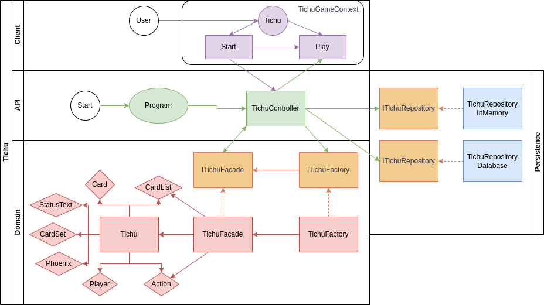

# Individual Project - Architecture

The architecture of the project is roughly described by the following diagram:

## Overview of API and communication between layers.

This diagram shows how the project is divided into a Client layer, API layer, domain layer and persistence layer. The front-end server deals with the Client layer, and the back-end server deals with the rest. The Start circle represents the entry point when starting up the back-end server. The Program file is executed and creates a TichuController. 

The entry point of the user into the front-end server is represented by the User circle. The front-end sends server requests that are received by the TichuController. The controller then either creates a new game via the ITichuFactory, gets a game from in-memory storage, or gets the game from the database if it is not contained in the in-memory storage. It then sends the request over to the domain layer for some operation if necessary, and returs the result in the format of a DTO.

## Overview of domain

The ITichuFacade and ITichuFactory are the only parts of the domain exposed to the other layers. The interface ITichuFacade consists of several information getters and a DoTurn funtion. The data communicated by these methods are simple string and integer formats (and the interface itself), so that C# can call these methods without issues. The TichuFacade object's main job is to implement these interface members and convert between basic formats and F#-specific objects such as records (or product types) and discrimated unions (or sum types). 

In particular, the TichuGame object defined in the Tichu file is nothing but a record containing the game state. Since F# is a functional programming language, the TichuGame object does not have mutable state. Consequentely, it also has no member methods changing state. As such, the main 'DoTurn' function is not a member function of the TichuGame object but rather accepts a TichuGame object together with an 'Action' object representing the player action. It outputs a completely new TichuGame object, containing the updated game state (each of whose components are also created anew).

The logic of the DoTurn function is spread over several modules, each representing some smaller object of the game state. For example, the logic for determing the type of a set of cards (pair, straight, full house, etc) as well as the logic for comparing these types is contained in the 'CardSet' module. The logic for removing a set of cards from a hand (i.e. a list of cards) and sorting a list of cards is contained in the CardList module. 

The cards themselves are represented by a special discrimanted union type 'Card'. They do not have suits yet, although I hope to implement that if I still have some time. The Card type has a member function returning a numeric value of the card, which is used to compare card sets and to order cards in a card list (i.e. so that a hand is ordered in the UI).

The Phoenix case deserves some extra attention. It contains 2 values to represent in what way it is being played. The behaviour of the phoenix is different depending on whether it is played as a single or as part of a set: as a single, it is one half higher than the previously played card; as part of a set it functions as a joker that can be declared as a (normal!) card of choice. The 'isSingle' value represents this information, and is (arbitrarily) set to true before the phoenix is played. If the phoenix is played as part of a set, the 'valueCopied' field represents what card it is being declared as. If the phoenix is played as a single, the field instead represents the previous card of the trick. The logic for setting this field is contained in a separate module 'Phoenix'.

## Overview of front-end

The front-end uses the React useContext functionality to provide the game state to each of its components. If the gameState is already set, the Play page displaying the game is loaded. After some user action, the appropriate component calls a function of the Client-side api, which sends a request to the back-end server. The gameState is then updated by the component, and React re-renders the page. 

If the gameState is not yet set, the start screen is loaded instead. Here the user can fill in the player names and start a new game. If a game was still in progress, a Continue Previous Game button is shown. This button loads the last gameID from the localstorage and requests the gameState from the back-end. This can be useful if the page was refreshed for instance. The user can also go back to the start screen at any time and then continue where they left off. However, if a new game is started, the old game is lost. 